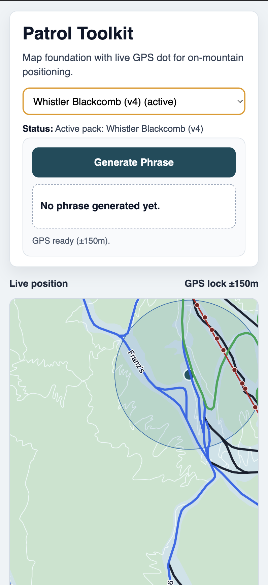

# Patrol Toolkit

**Patrol Toolkit** is an offline-first, data-driven web platform designed to support mountain patrol operations in complex alpine environments.

It enhances clarity, reduces cognitive load, and accelerates terrain awareness without replacing radio or existing patrol workflows.

Radio remains the primary communication channel.  
Patrol Toolkit supports it.

---

## Why This Exists

Mountain terrain is complex. Patrol callouts must be precise and concise. Connectivity is unreliable. Terrain knowledge takes years to internalize.

Under pressure during an accident response, sweep, or low-visibility condition, hesitation and ambiguity on the radio increase cognitive load and slow coordination.

Patrol Toolkit exists to provide reliable, offline spatial intelligence that improves clarity and confidence in patrol communication.

---

## Vision

Patrol Toolkit is designed as a modular operational platform for mountain patrol teams.

Long term, it aims to support:

- GPS-to-radio location translation  
- Sweep route assistance  
- Terrain knowledge indexing  
- Operational overlays and context  
- Shared situational awareness  

All built on portable, structured Resort Packs that separate terrain data from application logic.

---

## Current Product State (February 21, 2026)



Patrol Toolkit is now in a multi-resort, offline-ready operational state with deterministic phrase generation and publish integrity controls.

### Current Capabilities

- One active resort context in app (switchable from locally published packs).
- Offline app shell + offline basemap + offline overlays (boundary/runs/lifts).
- Runs rendered as line geometry with difficulty-based coloring.
- Run labels with zoom/readability tuning.
- Deterministic phrase generation with objective distance-based anchors.
- CLI basemap controls: generate/publish, dry-run preview, force rebuild.
- Publish safety gate: requires manual validation **and** readiness `ready`.
- CLI rollback control: `Unpublish resort` removes published app artifacts without deleting resort source data.

### Available Published Resorts

As of `2026-02-21`, `public/resort-packs/index.json` includes:

- `CA_Beaupre_Mont_Sainte_Anne` (`v4`)
- `CA_Chelsea_Camp_Fortune` (`v4`)
- `CA_Fernie_Fernie` (`v7`)
- `CA_Golden_Kicking_Horse` (`v1`)
- `CA_Kimberley_Kimberley_Resort` (`v5`)
- `CA_Rossland_Red_Mountain_Resort` (`v6`)
- `CA_Whistler_Whistler_Blackcomb` (`v4`)

### Roadmap v2 Progress

| Slice | Status | Summary |
|---|---|---|
| Slice 1 | Completed | Phrase v2 spec finalized |
| Slice 2 | Completed | Phrase v2 engine shipped |
| Slice 3 | Completed | Run line rendering + difficulty colors |
| Slice 4 | Completed | Run labels + readability tuning |
| Slice 5 | Completed | Basemap regenerate controls |
| Slice 6 | Completed | Offline diagnostics + SW hardening |
| Slice 7 | Completed | Multi-resort integrity + publish hardening |
| Slice 8 | In progress | Docs/runbook/signoff evidence |

---

## Core Principles

Patrol Toolkit is built under strict operational constraints.

### Offline First
All core functionality must work without network connectivity after initial install and pack download.

### Deterministic Logic
All operational phrasing is geometry-based and reproducible.  
No AI-generated text is used for location output.

### Data Driven
Resort-specific behavior is defined via structured Resort Packs.  
The application contains no hard-coded resort logic.

### One Resort Context
The app operates against one active resort at a time to reduce ambiguity during radio operations.

### Assistive Only
Patrol Toolkit supports decision-making.  
It never replaces radio, protocol, or operational judgment.

---

## Architecture

- TypeScript
- Lit Web Components
- MapLibre GL JS
- PMTiles for offline basemaps
- IndexedDB for local data storage
- Progressive Web App with Service Worker
- Pluggable GeoEngine interface, WebAssembly optional in future

All terrain intelligence is computed locally on device.

No backend is required for the MVP.

---

## Resort Packs

Each resort is defined through a portable data pack containing:

- Boundary
- Runs
- Lifts
- Lift towers
- Threshold rules
- Basemap tiles

This architecture allows Patrol Toolkit to scale across multiple resorts without modifying core application logic.

---

## Roadmap Overview

### v0.0.1 (Released)
- Offline app shell
- Resort pack import/select/active persistence
- Deterministic phrase baseline

### v2 Program (Current)
- Slices 1-7 complete
- Slice 8 docs/signoff in progress
- Focus: operational closure and auditable handoff artifacts

### Next Program Focus
- Handling strategy for resorts without reliable boundary data
- Expanded operational overlays (sweep/terrain context)
- Continued multi-resort validation at scale

Roadmap evolves based on real field feedback from patrol use.

---

## Safety Notice

Patrol Toolkit is an assistive tool.

It does not replace:

- Radio communication
- Established patrol protocols
- Operational training
- Situational judgment

Radio remains the authoritative communication channel at all times.

---

## Status

Active MVP refocus on map-first offline capabilities for radio clarity.

---

## Local Development

Run locally:

```bash
npm install
npm run dev
```

Quality gate:

```bash
npm run check
```

Offline verification:

1. Build and preview with `npm run build && npm run preview`.
2. Open the app once online to allow service worker install and asset caching.
3. Disable network in browser devtools and reload.
4. Confirm the app shell still loads.
5. Confirm active resort geometry (boundary/runs/lifts) renders with no network access.

Field validation and release resources:

- [v0.0.1 field trial runbook](docs/field-trial/v0.0.1-runbook.md)
- [v0.0.1 patrol feedback template](docs/field-trial/v0.0.1-feedback-template.md)
- [v0.0.1 release notes and tagging procedure](docs/releases/v0.0.1.md)
- [v2 operations runbook](docs/runbooks/v2-operations-runbook.md)
- [v2 troubleshooting matrix](docs/runbooks/v2-troubleshooting-matrix.md)
- [v2 upgrade notes](docs/releases/v2-upgrade-notes.md)
- [v2 acceptance checklist](docs/checklists/v2-exit-acceptance-checklist.md)
- [v2 evidence bundle template](docs/evidence/v2-exit-evidence-template.md)
- [v2 acceptance checklist (2026-02-21)](docs/checklists/v2-exit-acceptance-2026-02-21.md)
- [v2 evidence bundle (2026-02-21)](docs/evidence/v2-exit-evidence-2026-02-21.md)
- [tools workspace docs](tools/README.md)
- [OSM extractor get started](tools/osm-extractor/GET_STARTED.md)
- [OSM extractor CLI docs](tools/osm-extractor/README.md)
- [OSM extractor troubleshooting](tools/osm-extractor/docs/troubleshooting.md)
- [OSM extraction playbook](tools/osm-extractor/docs/data-extraction-playbook.md)
- [Resort handoff checklist](tools/osm-extractor/docs/checklists/resort-handoff.md)

---

## License

MIT.
