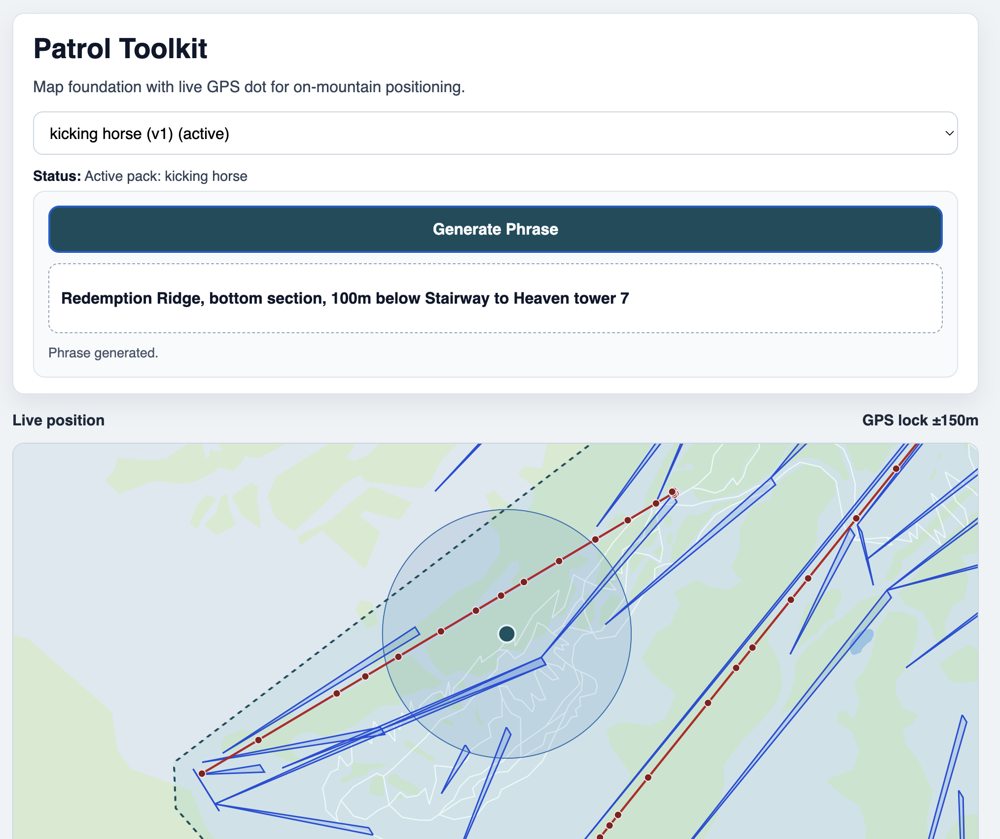

# Patrol Toolkit

**Patrol Toolkit** is an offline-first, data-driven web platform designed to support mountain patrol operations in complex alpine environments.

It enhances clarity, reduces cognitive load, and accelerates terrain awareness without replacing radio or existing patrol workflows.

Radio remains the primary communication channel.  
Patrol Toolkit supports it.

---

## Why This Exists

Mountain terrain is complex. Patrol callouts must be precise and concise. Connectivity is unreliable. Terrain knowledge takes years to internalize.

Under pressure during an accident response, sweep, or low-visibility condition, hesitation and ambiguity on the radio increase cognitive load and slow coordination.

Patrol Toolkit exists to provide reliable, offline spatial intelligence that improves clarity and confidence in patrol communication.

---

## Vision

Patrol Toolkit is designed as a modular operational platform for mountain patrol teams.

Long term, it aims to support:

- GPS-to-radio location translation  
- Sweep route assistance  
- Terrain knowledge indexing  
- Operational overlays and context  
- Shared situational awareness  

All built on portable, structured Resort Packs that separate terrain data from application logic.

---

## Current Scope — App MVP (Map + Phrase)

The current MVP focus is:
- one active resort at a time
- offline map context
- boundary/run/lift representation
- deterministic phrase generation for radio callouts

## Current App Snapshot vs Roadmap v2 (February 2026)



The screenshot above reflects the current state of the app in field-like usage:
- Active resort selected (`kicking horse v1`)
- Live map with boundary, runs, and lifts overlays
- GPS lock and phrase generation in one operational screen
- Phrase output now includes objective anchor references (example: `100m below Stairway to Heaven tower 7`)

Roadmap v2 alignment:

| Roadmap v2 Slice | Status | Current Evidence |
|---|---|---|
| Slice 1: Phrase v2 Discovery + Spec | Completed | Phrase spec documented in `roadmaps/roadmap_v2_phrase_spec.md` |
| Slice 2: Phrase v2 Engine | In progress | Context->decision->render phrase logic and anchor improvements |
| Slice 3: Run Rendering v2 | Planned | Current runs render, but styling and readability upgrades pending |
| Slice 4: Run Labels v2 | Planned | Labels tuning not started |
| Slice 5: Basemap Regeneration Controls | Planned | Basemap generation works; UX/control improvements pending |
| Slice 6: Offline Diagnostics + SW Hardening | Planned | Core offline works; additional diagnostics/hardening pending |
| Slice 7: Multi-Resort Validation + Integrity | Planned | Single-resort validation done; multi-resort matrix pending |
| Slice 8: Docs/Runbook v2 + Exit Signoff | Planned | v0.0.1 docs exist; v2 closure docs pending |

### Status Snapshot

- Ready: single active resort selection from local packs.
- Ready: deterministic phrase generation from GPS + run/lift geometry.
- Ready: offline app shell and local pack persistence.
- Ready: resort boundary rendered in app map.
- Ready: runs rendered in app map.
- Ready: lifts rendered in app map.
- Ready: local offline basemap path through generated and published resort assets.
- Ready: generate phrase is the primary radio action (copy phrase removed).

---

## Core Principles

Patrol Toolkit is built under strict operational constraints.

### Offline First
All core functionality must work without network connectivity after initial install and pack download.

### Deterministic Logic
All operational phrasing is geometry-based and reproducible.  
No AI-generated text is used for location output.

### Data Driven
Resort-specific behavior is defined via structured Resort Packs.  
The application contains no hard-coded resort logic.

### One Resort Context
The app operates against one active resort at a time to reduce ambiguity during radio operations.

### Assistive Only
Patrol Toolkit supports decision-making.  
It never replaces radio, protocol, or operational judgment.

---

## Architecture

- TypeScript
- Lit Web Components
- MapLibre GL JS
- PMTiles for offline basemaps
- IndexedDB for local data storage
- Progressive Web App with Service Worker
- Pluggable GeoEngine interface, WebAssembly optional in future

All terrain intelligence is computed locally on device.

No backend is required for the MVP.

---

## Resort Packs

Each resort is defined through a portable data pack containing:

- Boundary
- Runs
- Lifts
- Lift towers
- Threshold rules
- Basemap tiles

This architecture allows Patrol Toolkit to scale across multiple resorts without modifying core application logic.

---

## Roadmap Overview

### 0.0.1 (Baseline, Ready)
- Offline app shell
- Resort pack import/select/active persistence
- GPS-driven deterministic phrase generation

### 0.0.2 (Current Focus, In Progress)
- Render boundary, runs, and lifts from active resort pack
- Fully offline map path for basemap + overlays

### 0.1.x (Next)
- Operational support tools such as sweep reference overlays and terrain knowledge layers

### 0.2.x
- Optional shared situational awareness capabilities

### 1.0.0
- Stable multi-resort operational platform

Roadmap evolves based on real field feedback from patrol use.

---

## Safety Notice

Patrol Toolkit is an assistive tool.

It does not replace:

- Radio communication
- Established patrol protocols
- Operational training
- Situational judgment

Radio remains the authoritative communication channel at all times.

---

## Status

Active MVP refocus on map-first offline capabilities for radio clarity.

---

## Local Development

Run locally:

```bash
npm install
npm run dev
```

Quality gate:

```bash
npm run check
```

Offline verification:

1. Build and preview with `npm run build && npm run preview`.
2. Open the app once online to allow service worker install and asset caching.
3. Disable network in browser devtools and reload.
4. Confirm the app shell still loads.
5. Confirm active resort geometry (boundary/runs/lifts) renders with no network access.

Field validation and release resources:

- [v0.0.1 field trial runbook](docs/field-trial/v0.0.1-runbook.md)
- [v0.0.1 patrol feedback template](docs/field-trial/v0.0.1-feedback-template.md)
- [v0.0.1 release notes and tagging procedure](docs/releases/v0.0.1.md)
- [tools workspace docs](tools/README.md)
- [OSM extractor get started](tools/osm-extractor/GET_STARTED.md)
- [OSM extractor CLI docs](tools/osm-extractor/README.md)
- [OSM extractor troubleshooting](tools/osm-extractor/docs/troubleshooting.md)
- [OSM extraction playbook](tools/osm-extractor/docs/data-extraction-playbook.md)
- [Resort handoff checklist](tools/osm-extractor/docs/checklists/resort-handoff.md)

---

## License

MIT.
